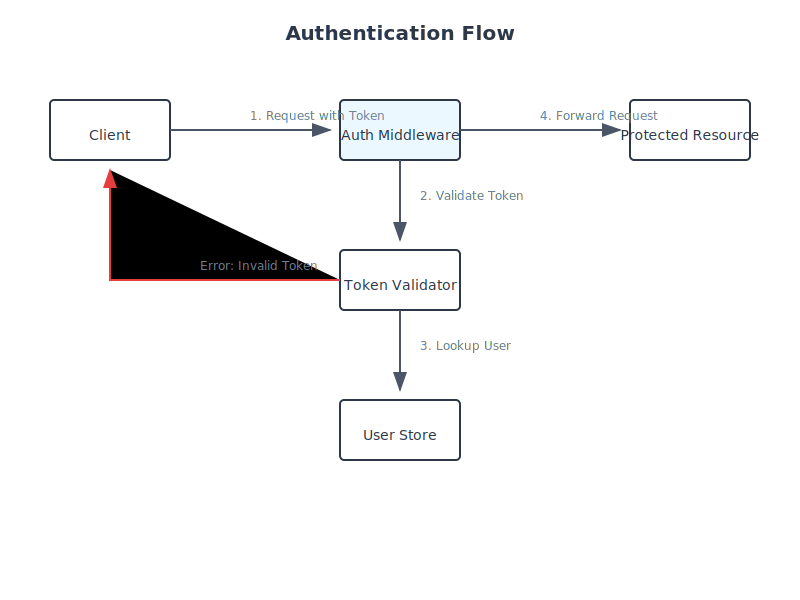
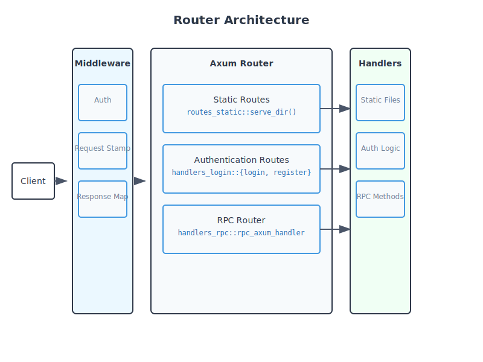

# 🚀 Rust Enterprise Web Server

[](https://www.rust-lang.org)
[](https://github.com/tokio-rs/axum)
[](https://opensource.org/licenses/MIT)

A production-ready, high-performance web server framework built in Rust. Designed with enterprise-grade security, scalability, and developer experience in mind.

## 🔒 Authentication Flow

The authentication system provides secure, JWT-based user authentication with automatic password scheme upgrading.


Key features:
- 🔑 JWT-based authentication with secure cookie management
- 🔒 Password validation with modern security requirements
- 🔄 Automatic password scheme upgrading
- 🚪 Stateless session management

## 🏗️ Router Architecture

The router system provides a modular, middleware-based architecture for handling requests.



## ✨ Key Features

### Advanced RPC System

```json
// Example RPC request
{
    "jsonrpc": "2.0",
    "id": 1,
    "method": "user.create",
    "params": {
        "username": "john_doe",
        "email": "john@example.com"
    }
}
```

- ⚡ JSON-RPC 2.0 compliant
- 🎯 Automatic parameter validation
- 🔍 Detailed error responses
- 🧩 Extensible resource system

### Enterprise Middleware Stack

```rust
// Request tracking middleware with UUID generation
pub async fn mw_req_stamp_resolver(
    mut req: Request<Body>,
    next: Next,
) -> Result<Response> {
    let stamp = ReqStamp {
        uuid: Uuid::new_v4(),
        time_in: now_utc()
    };
    req.extensions_mut().insert(stamp);
    Ok(next.run(req).await)
}
```

- 📝 Request tracking with UUIDs
- ⏱️ Performance monitoring
- 🔒 Authentication middleware
- 🎯 Response transformation

### Production-Ready Error Handling

```rust
// Rich error types with client-safe responses
#[derive(Debug, Serialize)]
pub enum ClientError {
    LOGIN_FAIL,
    NO_AUTH,
    ENTITY_NOT_FOUND { entity: &'static str, id: i64 },
    SERVICE_ERROR,
    // ... more error types
}
```

- 🎯 Type-safe error handling
- 🔍 Detailed internal debugging
- 🛡️ Safe client responses
- 📊 Error tracking and metrics

### Enterprise Logging System

```rust
// Structured request logging
#[derive(Serialize)]
struct RequestLogLine {
    uuid: String,
    timestamp: String,
    duration_ms: f64,
    http_path: String,
    user_id: Option<i64>,
    // ... more fields
}
```

- 📊 Structured logging
- 🔍 Request tracing
- ⏱️ Performance metrics
- 🔄 Context preservation

### Security Features

- 🔒 HTTPS/TLS with automatic certificate reloading
- 🛡️ HTTP-only secure cookies
- 🔑 Salt-based password hashing
- 🚫 Information leakage prevention

## 🛠️ Tech Stack

- 🦀 **Rust** - Systems programming language
- ⚡ **Axum** - Web framework
- 🗼 **Tower** - Middleware framework
- ⚡ **Tokio** - Async runtime
- 🔄 **Serde** - Serialization
- 📝 **Tracing** - Logging
- 🔒 **RustLS** - TLS implementation

## 🚀 Getting Started

1. Add as a dependency:
```toml
[dependencies]
web-server = { git = "https://github.com/yourusername/web-server" }
```

2. Basic usage:
```rust
use web_server::{WebServer, Config};

#[tokio::main]
async fn main() {
    let config = Config::default();
    let server = WebServer::new(config);
    server.run().await;
}
```

## 🧪 Testing

```bash
cargo test
cargo test --features integration-tests
```

## 📚 Documentation

Full documentation is available at [docs.rs](https://docs.rs/web-server).

## 🤝 Contributing

Contributions are welcome! Please feel free to submit a Pull Request.

## 📝 License

This project is licensed under the MIT License - see the [LICENSE](LICENSE) file for details.

## ⭐ Show Your Support

Give a ⭐️ if this project helped you!

## 📫 Contact

- GitHub: [@yourusername](https://github.com/eohyungk)

---

Built with ❤️ by [Eohyungk]
